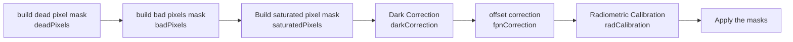

# Janus Calibration Database

This is the repository of the calibration database for the JANUS camera on board the ESA JUICE mission.

The database consists of three elements:
- The `version.yml` file, which contains the version number of the database
- The `calib_db.csv` file, which contains information about the calibration data and their scope of applicability (see the specific [section](#calibration-db-fields) for details)
- The `data` folder, which contains the calibration matrices

## Calibration schema

The Calibration Schema is reported in the following diagram:

## Calibration DB fields

- **Description** Description of the step (used for messaging and log)
- **Calibration_Step** name of the step will use the matrix
- **Size** size of the matrix (used for load the data)
- **Mask** value used to mask the pixel. If the value is 0 the mask will not applied.
- **Type** Is the data type of the values in the matrix.
- **Func** is the type of function will be used for the calibration. See specific section
- **Filter** is the filter number
- **Start** is the start date of validity of the matrix
- **End** is the end date of validity of the matrix. If the value is "*Now*" means that there is no end of validity.
- **File** is the path and the the name of the file containing the matrix.

